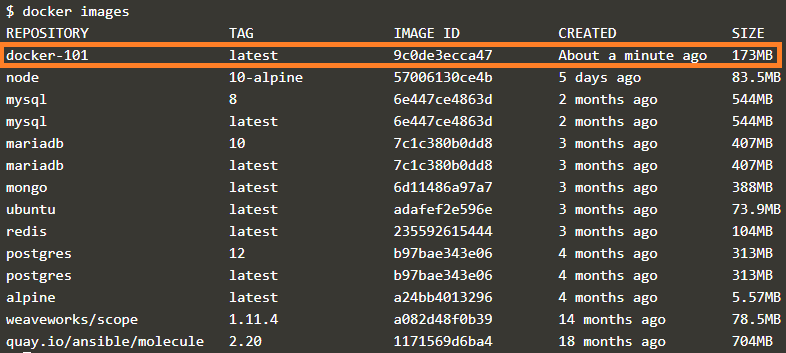

샘플 애플리케이션을 컨테이너 이미지로 만들어 보겠습니다.

​     
컨테이너 이미지가 뭔지 모르셔도 됩니다.

우선 따라와보세요.

​     
아래 명령어는 이미지를 만드는(build) 명령어 입니다.

`docker build --tag docker-101 .`{{execute}}

​     
터미널을 보면 뭔가 열심히 만드는 것 같네요.

다운로드도 하고, COPY도 하고, install도 하고...

​     
이제 잘 만들어졌는지 볼까요?

현재 있는 이미지를 조회하는 명령어입니다.

`docker images`{{execute}}

​     
아래 그림처럼 `docker-101` 이 보이면 성공입니다.     ٩(ˊᗜˋ*)و    

​     

