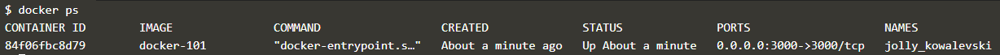

이제 샘플 애플리케이션을 실행해 보겠습니다.

​     
앞에서는 컨테이너 이미지를 만들었습니다.

이번에는 이 이미지를 실제 컨테이너로 실행(run)해 보겠습니다.

실행하는 명령어는 다음과 같습니다.

`docker run --detach --publish 3000:3000 docker-101`{{execute}}

​      
잘 실행되고 있는지 볼까요?

`docker ps`{{execute}}

​      
아래 그림처럼 `docker-101` 이 보이면 정상입니다.

​      
이제 `Terminal`의 `Display 3000` 탭을 눌러보세요.

3000번 포트를 통해서 우리의 샘플 애플리케이션에 접속합니다.

​     
여러분의 ToDo List Manager 애플리케이션이 잘 동작하나요?

오늘 할 일을 한 번 추가해 보세요.

​     
축하합니다!!!     (ง˙∇˙)ว

여러분은 방금 10분만에 뚝딱 시스템 구축을 마쳤습니다.
